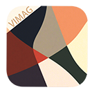

# Vimag
        <!-- 语言使用排行 -->
[](https://github.com/fantasywoc/Vimag) 

# xmake编译项目
## Debug模式
```xmake config -m debug```

## Release模式
```xmake config -m release```

## 清理构建
```xmake clean```

## 编译库配置
```xmake g --pkg_searchdirs=./src/thrity_party/```  #本地库文件搜索路径
## 编译
```
xmake
xmake run VIMAG 或者 xmake run VIMAG image-path/dist
```


# VIMAG


## Vimag格式支持
   - 支持多种图像格式（JPG/JPEG/PNG/BMP/GIF/TGA/HDR/PSD）
## 快捷键
[鼠标]/[键盘]
- 滚轮：缩放
- 左键拖拽：移动
- 左键双击：重置移动和缩放
- 左键单击+滚轮||左右方向键：切换图片
- 中键||"F"：窗口最大化/最小化
- 右键单击：打开设置面板
- 鼠标移入窗口上边缘：显示标题栏

- **预览**：选中图片后，空格预览/关闭预览图像(仅支持windows)(需要启用Vimag_hook)
[windows Vimag_hook]
windows 运行dist/Vimag_hook 可以启用预览钩子,
**Vimag_hook需要和Vimag放在同一目录下**
资源浏览器里面选中所支持的图像格式点击**空格**可以预览图像
- 托盘可以配置
    - 启用/禁止
    - 开始/暂停
    - 开机自启
    - 开启/关闭控制台(仅供简单调试使用)

## 项目结构

```
UI/
├── src/
│   ├── animation       # 动画类
│   ├── component       # 组件类
│   ├── TinyEXIF        # EXIF
│   ├── third_party     # 库
│   ├── utils           # 工具函数
│   ├── font            # 字体类
│   ├── icon            # 图像资源
│   ├── UIWindow.h      # UIWindow 类头文件
│   ├── UIWindow.cpp    # UIWindow 类实现
│   └── Vimag.cpp       # Vimag 程序
├── xmake.lua           # 构建配置
└── README.md           # 项目说明
```


## 依赖库

- **GLFW 3.3.8**: 窗口管理和输入处理
- **GLEW 1.13.0**: OpenGL 扩展加载
- **NanoVG**: 2D 矢量图形渲染


# UI 框架

基于 GLFW、OpenGL 和 NanoVG 开发的 UI 窗口项目,。
## 特性

- ✅ 跨平台支持（Windows/Linux）
- ✅ Opengl渲染
- ✅ 透明窗口支持
- ✅ 事件回调系统
- ✅ 自动资源管理
- ✅ NanoVG 集成

## UIWindow 类的主要功能

### 1. 窗口管理
- 创建、初始化、清理GLFW窗口
- 窗口生命周期管理
- 自动资源清理

### 2. 渲染上下文
- 管理OpenGL和NanoVG上下文
- 自动初始化GLEW
- 提供统一的渲染环境

### 3. 事件处理
- 封装鼠标、键盘事件处理
- 简化输入状态查询
- 支持光标位置获取

### 4. 渲染循环
- 提供便捷的渲染开始/结束方法
- 自动处理帧缓冲区管理
- 简化渲染流程

### 5. 回调系统
- 支持自定义事件回调函数
- 键盘、鼠标、窗口大小变化回调
- 类型安全的回调接口

### 6. 窗口属性
- 透明度、大小等属性设置
- 透明帧缓冲区支持
- 灵活的窗口配置选项

 
# xmake 代码提示和补全配置
## clangd 配置xmake 代码提示和补全
## clangd安装
(以 VSCode 为例)安装 ​**vscode-clangd**​ 插件（在扩展商店搜索安装）
然后下载安装⏬```https://github.com/llvm/llvm-project/releases``` ,bin路径添加到环境变量
##配置xmake(​核心配置步骤​)
1. ​生成 compile_commands.json（编译数据库）​​

​自动更新​：在 xmake.lua 中添加规则：
```lua
add_rules("plugin.compile_commands.autoupdate", { outputdir = ".vscode" })
```
​手动生成​：在项目根目录执行：
```bash
xmake project -k compile_commands
```
默认生成在项目根目录，可通过 --outputdir=.vscode 指定输出到 .vscode 目录。
每次编译时自动更新该文件。
2. ​ 配置 VS Code 的 Clangd 插件​
在 .vscode/settings.json 中指定编译数据库路径：

```json
{
  "clangd.arguments": [
    "--compile-commands-dir=${workspaceFolder}/.vscode",  // 指向 compile_commands.json 所在目录
    "--header-insertion=never",                           // 禁止自动插入头文件
    "--completion-style=detailed"                         // 启用详细补全提示
  ]
}
```
若文件在根目录，则路径改为 ${workspaceFolder}

<!-- 核心统计卡片 -->
[](https://github.com/fantasywoc/Vimag)


<!-- 仓库置顶卡片（示例） -->
[](https://github.com/fantasywoc/Vimag)

## 许可证

本项目采用开源许可证，具体请查看 LICENSE 文件。
